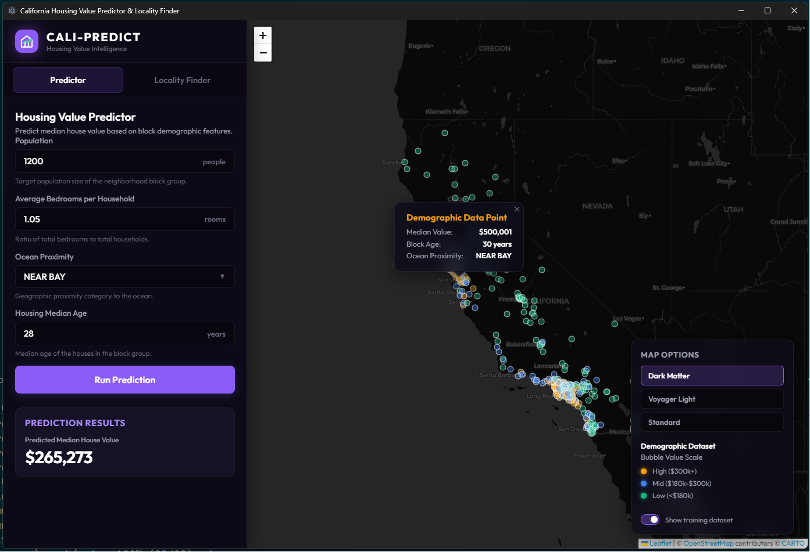
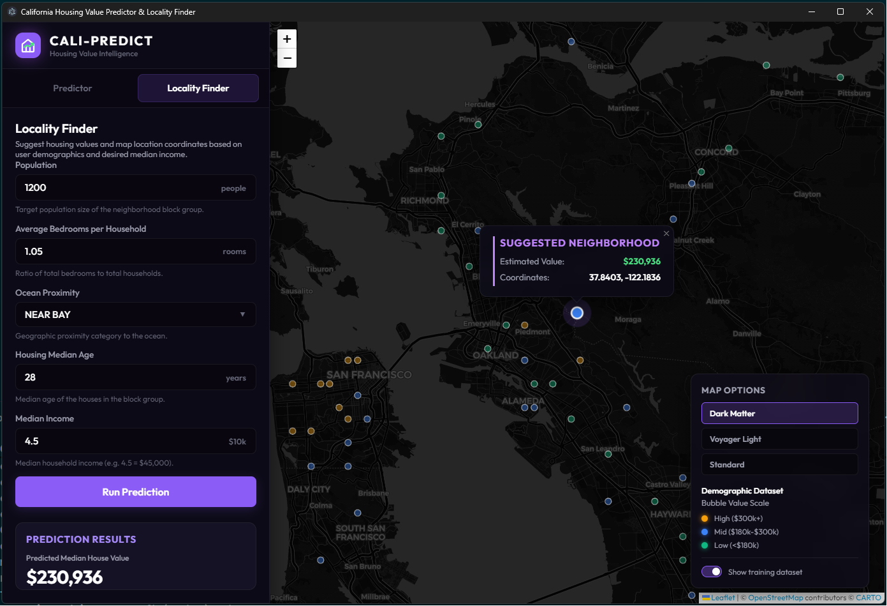

# Cali-Predict: California Housing Value Predictor & Locality Finder

Cali-Predict is a premium, interactive desktop application built with **Electron** and **Python** that leverages pre-trained **Random Forest Regressor** models to predict California median housing values and recommend optimal geographic localities on a Leaflet map.

## Application Screenshots

| Housing Value Predictor | Locality Finder & Suggestion Map |
| :---: | :---: |
|  |  |
| **Predictor Mode:** Shows value calculations (estimating **$265,273** for a sample block of 1,200 people) alongside the interactive California map overlay displaying historical data points. | **Locality Finder Mode:** Suggests recommended coordinates **(37.8403, -122.1836)** in the East Bay area and predicts an estimated value of **$230,936** based on a desired median income. |

---

## Key Features

*   **🏠 Demographics-based Predictor:** Enter target block demographic features (Population, Average Bedrooms per Household, Ocean Proximity, and Housing Median Age) to instantly calculate estimated median house values.
*   **📍 Locality Finder:** Suggests housing values and maps optimal location coordinates (Latitude and Longitude) based on block demographics and desired Median Income.
*   **🗺️ Interactive Maps (Leaflet.js):** Centers and pans to suggested coordinates, placing custom animated pulse markers on the map.
*   **🎨 Premium Glassmorphism Design:** A modern dark-themed dashboard featuring HSL-harmonized solid colors, loading state spinners, and smooth responsive scrolling.
*   **📊 Historical Overlay:** Toggle a downsampled overlay of 516 representative historical data points color-coded by value directly on the map.
*   **⚙️ Firewall-Free IPC:** Uses asynchronous line-delimited streams (`stdin`/`stdout`) for fast, secure communication between Electron's main process and the Python daemon, completely avoiding port collisions or windows firewall popups.

---

## Technical Details

The application runs predictions using two random forest regressors trained on the California housing dataset:
1.  **Housing Value Predictor (`rf1_hvp_model.pkl`):** Predicts `median_house_value` using `['population', 'avg_bed', 'ocean_proximity_encoded', 'housing_median_age']`.
2.  **Locality Finder (`rf2_lf_model.pkl`):** Suggests `['median_house_value', 'latitude', 'longitude']` using `['population', 'avg_bed', 'ocean_proximity_encoded', 'housing_median_age', 'median_income']`.

All inputs are scaled automatically on-the-fly using Z-score standardization parameters calculated directly from the training dataset.

---

## Prerequisites

Before running the application, make sure your environment has:

1.  **Node.js:** (v18.x or newer, recommended)
2.  **Python:** (v3.8 or newer)
3.  **Required Python Libraries:**
    *   `joblib`
    *   `scikit-learn` (version compatible with standard models, compiled locally on version `1.7.2` or newer)
    *   `pandas`
    *   `numpy`

Install Python dependencies using pip:
```bash
pip install joblib scikit-learn pandas numpy
```

---

## Installation & Setup

1.  Clone this repository to your local machine:
    ```bash
    git clone <your-repository-url>
    cd housing-value-pred
    ```

2.  Install the required Node.js dependencies:
    ```bash
    npm install
    ```

---

## How to Run

Launch the application using the following npm script:

```bash
npm start
```

This will spawn the Electron shell, initialize the Python background child process, and open the desktop application window.

---

## Project Structure

```
├── datasets/                 # California housing dataset files
├── models/                   # Pre-trained Random Forest models (.pkl)
├── cali_housing_points.json  # Representative downsampled points for map visualization
├── index.html                # Main application UI layout
├── main.js                   # Electron main process (spawns Python subprocess & manages IPC)
├── preload.js                # Context bridge exposing secure api.predict to renderer
├── renderer.js               # Frontend UI state and Leaflet map controller
├── styles.css                # Custom CSS styling sheet
├── predictor.py              # Python backend prediction daemon
└── package.json              # Project scripts and dependencies
```
